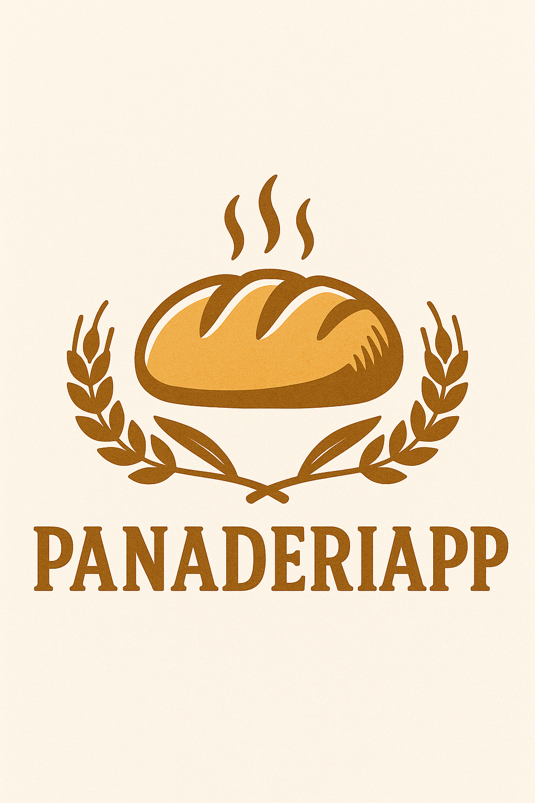
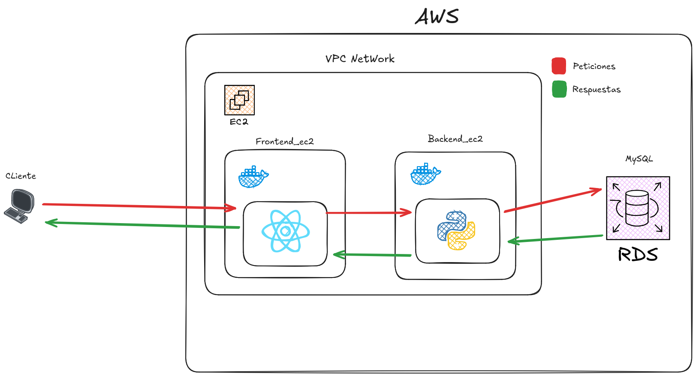

# Panaderiapp 🥐🥖🍞

  

## Descripción del Proyecto

Panaderiapp es una aplicación full-stack para la gestión integral de una panadería, permitiendo administrar productos, usuarios y pedidos. La aplicación facilita el seguimiento de inventario, gestión de pedidos y facturación para negocios de panadería, optimizando los procesos diarios de administración y atención al cliente.

## Tecnologías Utilizadas

### Backend
- **Django 4**: Framework web en Python para el desarrollo rápido y limpio del backend
- **Django REST Framework**: Para la creación de APIs RESTful
- **MySQL**: Sistema de gestión de base de datos relacional
- **JWT Authentication**: Para la autenticación y autorización segura
- **Docker**: Contenedorización de la aplicación backend
- **Gunicorn**: Servidor WSGI para producción

### Frontend
- **React 18**: Biblioteca JavaScript para construir interfaces de usuario
- **Vite**: Herramienta de construcción frontend moderna y eficiente
- **React Router**: Para la navegación entre páginas
- **Axios**: Cliente HTTP para comunicación con el backend
- **Bootstrap 5**: Framework CSS para diseño responsive
- **Apache**: Servidor web para servir la aplicación y configurar proxies
- **Docker**: Contenedorización de la aplicación frontend

### Infraestructura
- **AWS**: Proveedor de servicios en la nube
  - **EC2**: Instancias virtuales para backend y frontend
  - **RDS**: Base de datos MySQL administrada
  - **VPC**: Red virtual privada para seguridad
  - **Security Groups**: Reglas de firewall para control de acceso
  - **Subnets**: Organización de red pública y privada
- **Terraform**: Gestión de infraestructura como código (IaC)
- **DuckDNS**: Servicio de DNS dinámico para acceso mediante dominio

## Arquitectura

El proyecto sigue una arquitectura de microservicios con tres componentes principales:

- **Frontend**: Aplicación React servida por Apache, que actúa como proxy inverso
- **Backend**: API REST desarrollada en Django expuesta en el puerto 8000
- **Base de datos**: MySQL en AWS RDS para almacenamiento persistente de datos

La comunicación entre componentes se realiza a través de HTTP/S, con los siguientes flujos:
1. El cliente accede a la aplicación a través del dominio DuckDNS
2. Apache sirve los archivos estáticos y redirige las peticiones a al backend
3. El backend procesa las peticiones y se comunica con la base de datos
4. Las respuestas siguen el camino inverso hasta el cliente

### Requisitos Previos
- AWS CLI configurado con credenciales adecuadas
- Terraform v1.0+ instalado localmente
- Cuenta en DuckDNS con un dominio creado
- Token de DuckDNS para actualización automática de IP

- **Gestión de Productos**:
  - Catálogo completo de productos de panadería
  - Alta, baja y modificación de productos
  - Categorización y precios

- **Gestión de Usuarios**:
  - Registro y autenticación mediante JWT
  - Diferentes roles (administrador, vendedor, cliente)
  - Perfiles personalizados

- **Pedidos**:
  - Creación y seguimiento de pedidos
  - Carrito de compra intuitivo
  - Estados de pedido (pendiente, en proceso, entregado)
  - Fechas de entrega programadas

- **Facturación**:
  - Generación automática de facturas para los pedidos
  - Historial de compras por cliente
  - Reportes de ventas
